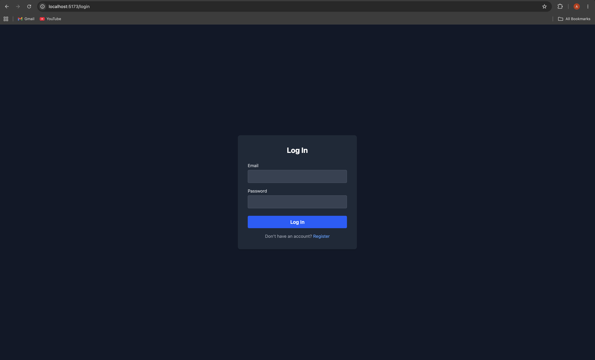
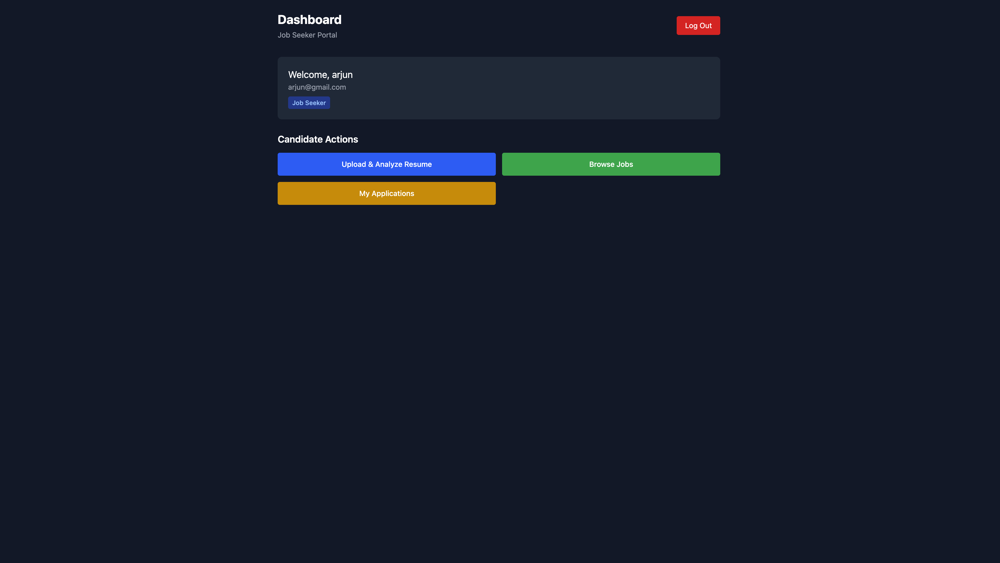
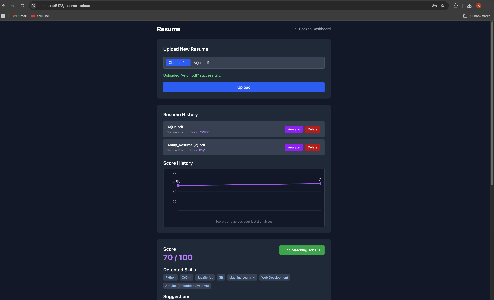
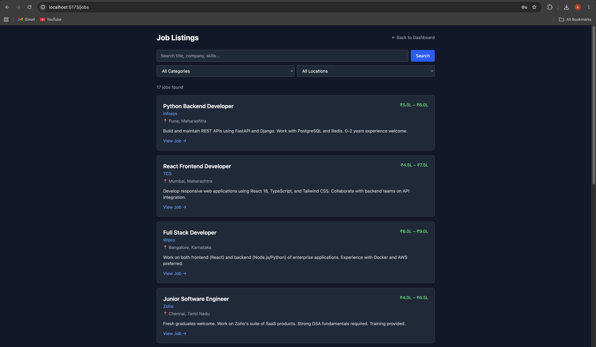
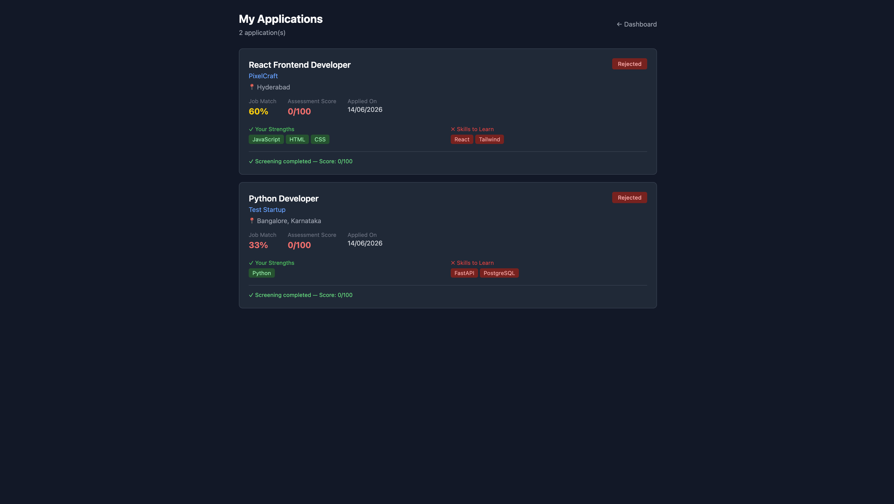
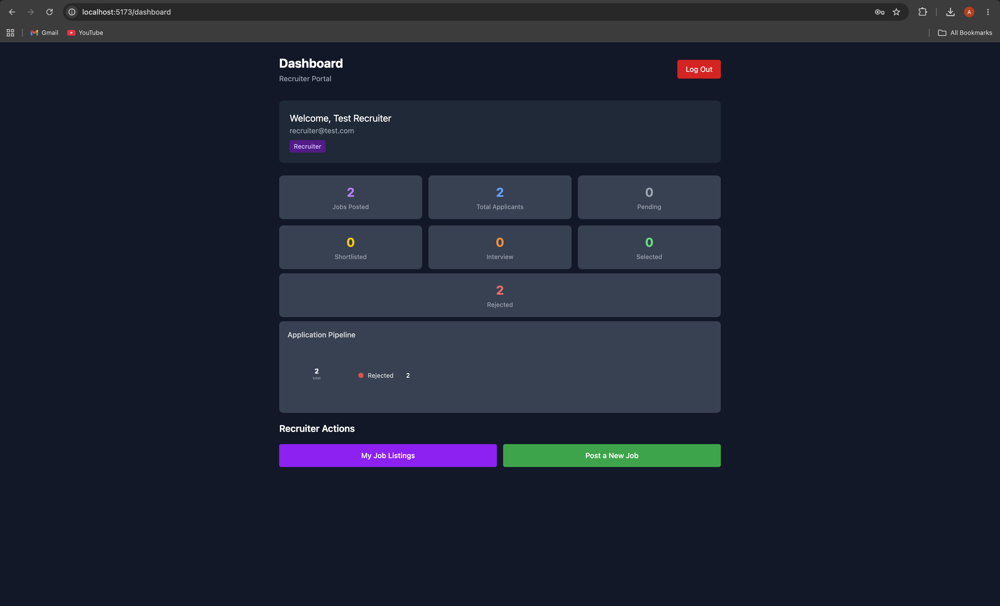
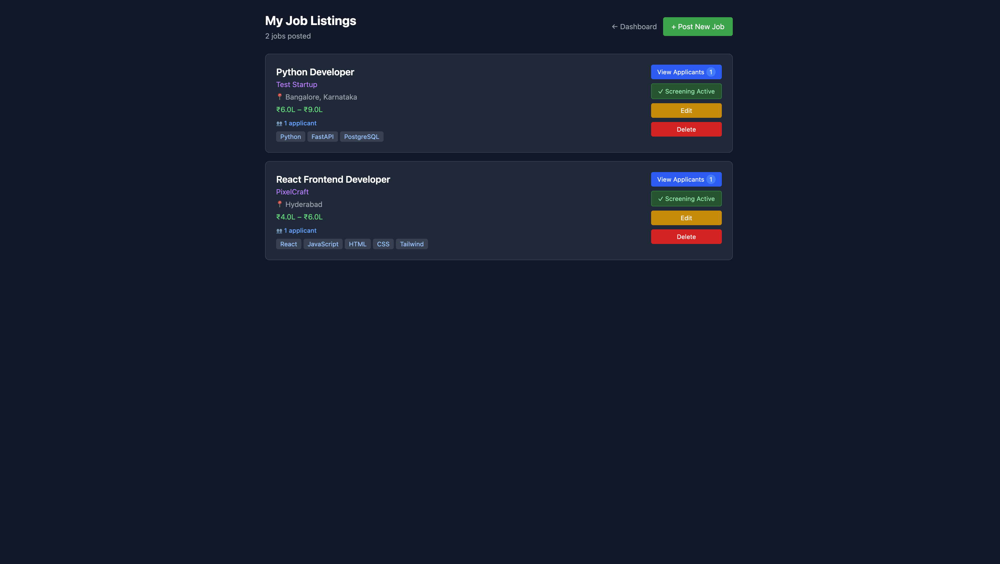
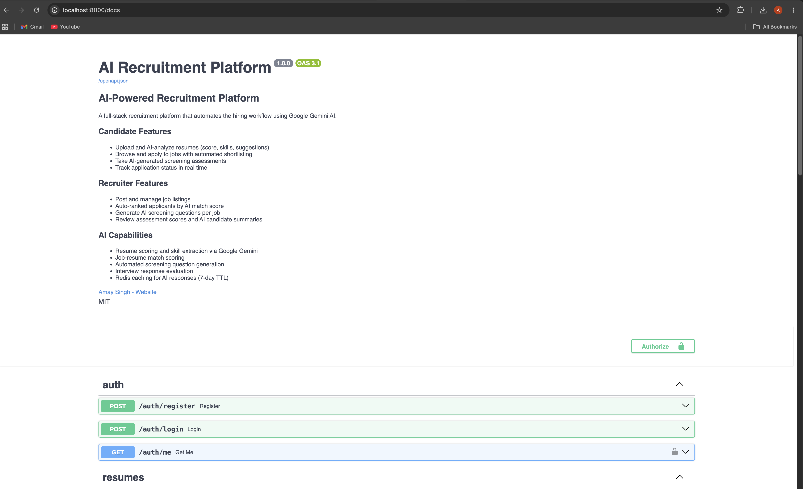

# CareerFlow AI

An end-to-end AI-powered recruitment platform that automates the hiring workflow — from resume analysis to candidate screening and interview assessment — built with FastAPI, React, PostgreSQL, Redis, and Google Gemini.

> Built as a flagship portfolio project by Amay Singh, B.Tech Robotics Graduate | Starting at JSW Motors, July 2026

[](https://www.linkedin.com/in/amay-singh-4b7852326/)
[](https://fastapi.tiangolo.com/)
[](https://react.dev/)
[](https://docs.docker.com/compose/)

---

## Problem Statement

Traditional hiring is slow, manual, and inconsistent. Recruiters spend hours screening resumes. Candidates get no feedback. Interview questions are generic. This platform automates the entire pipeline using AI — from the moment a candidate uploads a resume to the moment a recruiter makes a hiring decision.

---

## Live Demo

> **Live App:** https://successful-magic-production-5fa6.up.railway.app
>
> **API Docs:** https://careerflow-ai-production.up.railway.app/docs

**Test Accounts:**
| Role | Email | Password |
|------|-------|----------|
| Candidate | amay@gmail.com | amay123 |
| Recruiter | recruiter@test.com | recruiter123 |

---

## Screenshots

### Candidate Flow

| Login                           | Candidate Dashboard                               |
| ------------------------------- | ------------------------------------------------- |
|  |  |

| Resume Upload & Analysis          | Job Listings                          |
| --------------------------------- | ------------------------------------- |
|  |  |

| My Applications                               |
| --------------------------------------------- |
|  |

### Recruiter Flow

| Recruiter Dashboard                                         | Job Listings                                             |
| ----------------------------------------------------------- | -------------------------------------------------------- |
|  |  |

### API Documentation



---

## Features

### Candidate

- Register and login with JWT authentication
- Upload PDF/DOCX resume — AI extracts skills, scores resume out of 100, gives improvement suggestions
- Browse 15+ seeded jobs + recruiter-posted jobs with search and location filters
- Apply to internal jobs — system auto-shortlists or rejects based on resume score
- View application status, job match %, strengths, and missing skills in real time
- Take AI-generated screening assessments — answers evaluated by Gemini
- Track score history with SVG trend chart

### Recruiter

- Post, edit, and delete job listings with required skills
- View applicants ranked by AI job-match score
- Generate AI screening questions tailored to each job's requirements
- View candidate assessment scores and AI-generated summaries
- Update application status (Applied → Shortlisted → Interview → Selected → Rejected)
- Analytics dashboard with donut chart (shortlisted, interviews, rejected, selected)

### Platform

- Role-based access control (candidate vs recruiter)
- Redis caching for AI responses with 7-day TTL
- Automated hiring workflow — no manual shortlisting needed
- 13 automated API tests
- Health check endpoint with database connectivity verification
- Dockerized with 4-service Docker Compose setup

---

## Automated Hiring Workflow

```
Candidate uploads resume → AI scores resume (0-100)
         ↓
Candidate applies to internal job
         ↓
System auto-analyzes resume at apply time
  score > 50  → status = Shortlisted
  score ≤ 50  → status = Rejected
  no resume   → status = Applied
         ↓
Recruiter generates AI screening questions (saved, not regenerated)
         ↓
Shortlisted candidate takes screening assessment
AI evaluates answers → overall score + feedback saved
         ↓
Recruiter sees 🔔 badge for candidates scoring 60+
Recruiter manually sets final status → Selected
```

---

## Tech Stack

| Layer            | Technology              | Why                                                                       |
| ---------------- | ----------------------- | ------------------------------------------------------------------------- |
| Backend API      | FastAPI (Python 3.12)   | High performance, auto Swagger docs, async support                        |
| Database         | PostgreSQL 16           | Relational data, ACID compliance, JSON column support                     |
| Caching          | Redis 7                 | 7-day TTL cache for Gemini AI responses — reduces API costs               |
| Frontend         | React 19 + Vite 8       | Fast builds, modern React features                                        |
| Styling          | Tailwind CSS v4         | CSS-first config, utility classes                                         |
| Auth             | JWT + bcrypt            | Stateless auth, secure password hashing                                   |
| AI               | Google Gemini 2.5 Flash | Resume analysis, job matching, question generation, assessment evaluation |
| ORM              | SQLAlchemy 2.0          | Type-safe queries, migration support                                      |
| Migrations       | Alembic                 | Version-controlled schema changes                                         |
| Containerization | Docker + Docker Compose | 4-service setup: backend, frontend, db, redis                             |
| Web Server       | Nginx                   | Serves React build, proxies API calls                                     |
| Testing          | pytest                  | 13 API tests covering auth and job endpoints                              |

---

## Architecture

```
┌─────────────────────────────────────────────────────┐
│                    Docker Compose                    │
│                                                     │
│  ┌──────────┐    ┌──────────┐    ┌───────────────┐ │
│  │  Nginx   │    │ FastAPI  │    │  PostgreSQL   │ │
│  │  :80     │───▶│  :8000   │───▶│  :5432        │ │
│  │  React   │    │  uvicorn │    │               │ │
│  └──────────┘    └──────────┘    └───────────────┘ │
│                       │                             │
│                  ┌────┴─────┐    ┌───────────────┐ │
│                  │  Redis   │    │  Gemini API   │ │
│                  │  :6379   │    │  (external)   │ │
│                  │  Cache   │    │               │ │
│                  └──────────┘    └───────────────┘ │
└─────────────────────────────────────────────────────┘
```

**Key architectural decisions:**

**Redis caching for AI responses** — Gemini API calls are expensive and slow. Resume analysis results are cached by content hash with a 7-day TTL. Re-uploading the same resume returns cached results instantly.

**Automated shortlisting** — Instead of recruiters manually reviewing every application, the system auto-shortlists candidates at apply time based on AI resume score. Recruiters only see pre-filtered candidates.

**Role-based dependency injection** — FastAPI's `Depends()` system enforces role checks at the router level. Candidates hitting recruiter endpoints get 403 before any business logic runs.

**Centralized `get_db`** — Single database session factory in `database.py` injected everywhere via FastAPI's dependency override system — makes test database substitution clean and reliable.

---

## Database Schema

```
users
  id, email, hashed_password, full_name, role (candidate|recruiter), created_at

resumes
  id, user_id → users, filename, filepath, score (nullable), uploaded_at

jobs
  id, title, company, location, salary_min, salary_max, description,
  source_url, source (internal|external), recruiter_id → users,
  required_skills (JSON), interview_questions (JSON), created_at

applications
  id, job_id → jobs, candidate_id → users, resume_id → resumes,
  status (Applied|Shortlisted|Interview|Rejected|Selected),
  match_score, assessment_score, assessment_feedback,
  applied_at, updated_at
  UNIQUE(job_id, candidate_id)
```

6 Alembic migrations applied — full version-controlled schema history.

---

## API Documentation

Full interactive docs available at `/docs` (Swagger UI) and `/redoc`.

### Auth

| Method | Endpoint         | Description                     |
| ------ | ---------------- | ------------------------------- |
| POST   | `/auth/register` | Register candidate or recruiter |
| POST   | `/auth/login`    | Login, returns JWT token        |
| GET    | `/auth/me`       | Get current user                |

### Resumes

| Method | Endpoint                | Description                              |
| ------ | ----------------------- | ---------------------------------------- |
| GET    | `/resumes/mine`         | List my resumes with scores              |
| POST   | `/resumes/upload`       | Upload PDF/DOCX                          |
| POST   | `/resumes/{id}/analyze` | AI analysis — score, skills, suggestions |
| DELETE | `/resumes/{id}`         | Delete resume                            |

### Jobs

| Method | Endpoint                         | Description                                    |
| ------ | -------------------------------- | ---------------------------------------------- |
| GET    | `/jobs`                          | Public job listing with search + filter        |
| POST   | `/jobs`                          | Create job (recruiter)                         |
| GET    | `/jobs/mine`                     | My jobs with applicant counts (recruiter)      |
| GET    | `/jobs/recruiter/stats`          | Dashboard analytics (recruiter)                |
| PUT    | `/jobs/{id}`                     | Update job (recruiter)                         |
| DELETE | `/jobs/{id}`                     | Delete job (recruiter)                         |
| GET    | `/jobs/{id}/interview-questions` | Generate/fetch screening questions (recruiter) |

### Applications

| Method | Endpoint                                 | Description                                      |
| ------ | ---------------------------------------- | ------------------------------------------------ |
| POST   | `/applications/{job_id}/apply`           | Apply to job — auto-shortlists                   |
| GET    | `/applications/mine`                     | My applications with job details                 |
| GET    | `/applications/job/{job_id}`             | Job applicants ranked by match score (recruiter) |
| PATCH  | `/applications/{id}/status`              | Update status (recruiter)                        |
| GET    | `/applications/{id}/candidate-summary`   | AI summary (recruiter)                           |
| GET    | `/applications/{id}/interview-questions` | Fetch questions (shortlisted candidate)          |
| POST   | `/applications/{id}/evaluate`            | Submit + evaluate assessment answers             |

### Health

| Method | Endpoint  | Description                            |
| ------ | --------- | -------------------------------------- |
| GET    | `/health` | Service status + database connectivity |

---

## Local Setup

### Prerequisites

- Docker Desktop
- Git

### Steps

```bash
# Clone repository
git clone https://github.com/amaysingh/ai-recruitment-platform.git
cd ai-recruitment-platform

# Create backend environment file
cp backend/.env.example backend/.env
# Edit backend/.env and add your GEMINI_API_KEY

# Start all services
docker compose up -d --build

# Run database migrations
docker compose exec backend alembic upgrade head

# Seed sample jobs (run only once)
docker compose exec backend python seed_jobs.py

# Access the application
open http://localhost
```

### Environment Variables

Create `backend/.env` with these values:

```env
DATABASE_URL=postgresql://postgres:postgres@db:5432/jobhunter
REDIS_URL=redis://redis:6379/0
SECRET_KEY=your-secret-key-min-32-chars  # generate: openssl rand -hex 32
GEMINI_API_KEY=your-gemini-api-key        # get from: aistudio.google.com
```

### Running Tests

```bash
# Create test database (first time only)
docker compose exec db psql -U postgres -c "CREATE DATABASE jobhunter_test;"

# Run tests
docker compose exec backend python -m pytest app/tests/ -v
```

---

## Project Structure

```
ai-recruitment-platform/
├── backend/
│   ├── app/
│   │   ├── core/           # Config, security, dependencies
│   │   ├── models/         # SQLAlchemy models
│   │   ├── routers/        # FastAPI route handlers
│   │   ├── schemas/        # Pydantic request/response schemas
│   │   ├── services/       # AI analysis service (Gemini + Redis)
│   │   └── tests/          # pytest test suite
│   ├── alembic/            # Database migrations
│   ├── Dockerfile
│   └── requirements.txt
├── frontend/
│   ├── src/
│   │   ├── components/     # Reusable components (ErrorBoundary)
│   │   ├── context/        # Auth context
│   │   ├── pages/          # Page components
│   │   └── services/       # API client
│   ├── Dockerfile
│   └── nginx.conf
├── screenshots/            # UI screenshots
├── docker-compose.yml
└── README.md
```

---

## Future Roadmap

- [ ] AWS EC2 deployment with custom domain
- [ ] CI/CD pipeline with GitHub Actions
- [ ] Email notifications for status changes
- [ ] Resume parsing improvement with structured extraction
- [ ] WebSocket for real-time application status updates
- [ ] Multi-language resume support
- [ ] Analytics dashboard with hiring funnel metrics
- [ ] Mobile-responsive UI improvements

---

## Interview Discussion Points

This project demonstrates:

- **System design** — multi-service architecture with clear separation of concerns
- **AI integration** — practical use of LLMs beyond chatbots, with caching strategy
- **Security** — JWT auth, bcrypt hashing, role-based access control, secret management
- **Database design** — normalized schema, foreign keys, unique constraints, JSON columns
- **Testing** — dependency injection override pattern for test isolation
- **DevOps** — Docker multi-stage builds, Nginx reverse proxy, health checks
- **Production readiness** — error boundaries, centralized error handling, environment-based config

---

## Author

**Amay Singh**
B.Tech Robotics | Software Developer

[](https://www.linkedin.com/in/amay-singh-4b7852326/)

---

_Built with FastAPI + React + PostgreSQL + Redis + Google Gemini_
